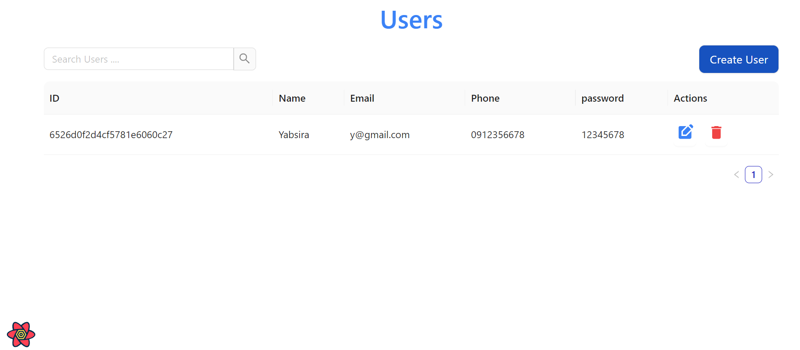
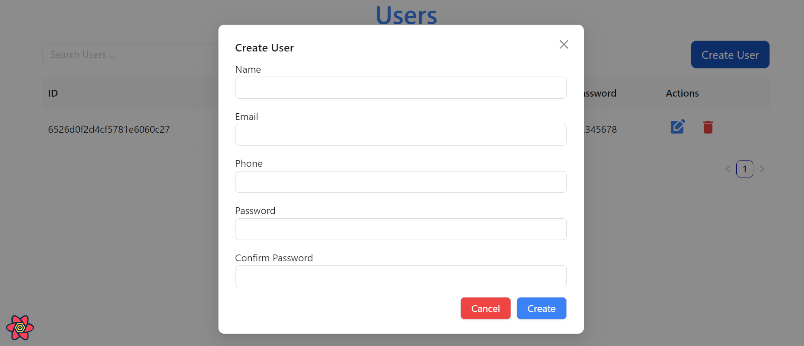
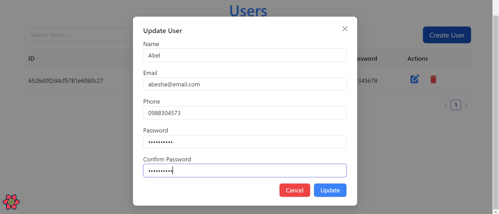

# User Management Crud Project

## Overview
  ### how the user list view look


 ### how the create user Modal look


### how the update user Modal look



Explore a meticulously architected user management solution, thoughtfully structured as a monorepo. It leverages the cutting-edge technologies of Vite, React, and NestJS, seamlessly integrated with the precision of Prisma. This sophisticated project empowers you with comprehensive user administration capabilities, including the addition, deletion, updating, and meticulous display of user data – all presented within a meticulously designed, professional-grade table interface


## Key Functionality
- Seamlessly add new users, complete with their name, email, password, and phone number.
- Effortlessly remove existing users.
- Precisely update user details, encompassing name, email, password, and phone number.
- Gain insight into all user data through a well-organized, information-rich table display.

## Prerequisites

- Ensure you have Node.js installed, preferably version 14 or newer.
- Confirm that you are using MongoDB Atlas as your database, and that it is correctly configured and running.
- For streamlined package management, it is advisable to utilize npm.

## Installation

1. Clone the repository:

   ```bash
   https://github.com/AbelAbesha1/User-Managment-Nest-react.git

2. Navigate to the project's root directory:
   
   ```bash
   cd User-Managment-Nest-react

4. Install the project dependencies:

    ```bash
   npm install

4. Set up the database connection:

   create a .env file

   Update the database connection URL in the Prisma .env file (e.g., DATABASE_URL= Here put your mongodb atlas db url.

5. go to the the server side

    ```bash
    cd nest-user

    ```bash
    npm install 

    ```bash
    npm run start:dev

6. Start the frontend:

    ```bash
   cd Frontend
    ``````
   ```bash
   npm install

   npm run dev
Your project should now be up and running.

### Usage

Access the application through your web browser.
Utilize the web interface to oversee user management, which includes tasks like adding new users, updating existing user data, or removing users as needed.
Explore the user table to view a comprehensive list of all registered users.